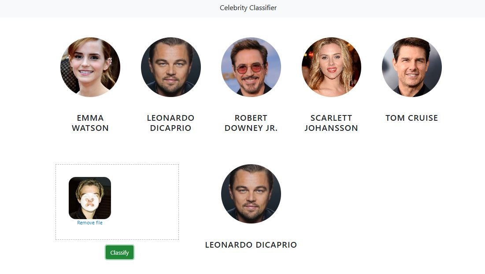

# Celebrity Face Recognition



A machine learning project that classifies images of celebrities using facial recognition. The system can identify 5 celebrities from uploaded images.

## Classifications

| Celebrity | Class Label |
|-----------|-------------|
| Emma Watson | emma_watson |
| Leonardo DiCaprio | leonardo_dicaprio |
| Robert Downey Jr. | robert_downey_jr |
| Scarlett Johansson | scarlett_johansson |
| Tom Cruise | tom_cruise |

---

## Project Structure

```
Image-Classifier/
├── Celebrityclassifier.ipynb    # Main notebook (empty)
├── README.md                    # This file
├── ui_snapshot.jpg              # UI screenshot
│
├── model/                       # Model training
│   ├── celebrity_classifier.ipynb  # Model building notebook
│   ├── data_cleaning.ipynb         # Data preprocessing
│   ├── Downloader.py               # Image download utility
│   ├── requirements.txt            # Python dependencies
│   ├── save_model.pkl              # Trained SVM model
│   ├── class_dictionary.json       # Class labels mapping
│   ├── dataset/                    # Raw training images
│   │   ├── Emma_Watson/
│   │   ├── Leonardo_DiCaprio/
│   │   ├── Robert_Downey_Jr/
│   │   ├── Scarlett_Johansson/
│   │   └── Tom_Cruise/
│   ├── opencv/                     # Haar cascade files
│   └── test_images/                # Test images for evaluation
│
├── server/                      # Flask API server
│   ├── server.py                 # Flask app with /classify_image endpoint
│   ├── util.py                   # Classification utilities
│   ├── wavelet.py                # Wavelet transform for feature extraction
│   ├── artifacts/                # Model artifacts
│   │   ├── save_model.pkl
│   │   └── class_dictionary.json
│   ├── opencv/                   # Haar cascade files for server
│   └── test_images/              # Test images
│
├── UI/                          # Frontend web interface
│   ├── app.html                  # Main HTML page
│   ├── app.js                    # JavaScript logic
│   ├── app.css                   # Styles
│   ├── dropzone.min.js           # Dropzone library
│   ├── dropzone.min.css          # Dropzone styles
│   ├── images/                   # Static images
│   └── test_images/              # Test images
│
└── google_image_scrapping/       # Image scraping tools
    ├── image_download.py
    └── chromedriver.exe
```

---

## How It Works

### 1. Data Collection & Cleaning

- Images are scraped from Google using `google_image_scrapping/image_download.py`
- OpenCV Haar Cascades detect faces and eyes
- Only images with **2 detected eyes** are kept for training
- Cropped faces are stored in `model/dataset/cropped/`

### 2. Model Training

The classification pipeline in `model/celebrity_classifier.ipynb`:

1. **Image Preprocessing**
   - Convert to grayscale
   - Detect face using Haar Cascade
   - Verify 2 eyes are present
   - Crop face region

2. **Feature Extraction**
   - Raw pixel features (32x32x3 = 3072 features)
   - Wavelet transform features (32x32 = 1024 features)
   - Combined feature vector: 4096 features

3. **Wavelet Transform**
   - Applies Discrete Wavelet Transform (DWT) using `pywt`
   - Extracts horizontal frequency components
   - Helps capture texture patterns

4. **Model Selection**
   - SVM (Support Vector Machine) with RBF kernel
   - GridSearchCV for hyperparameter tuning
   - Cross-validation for robust evaluation

5. **Output**
   - Trained model saved as `save_model.pkl`
   - Class dictionary saved as `class_dictionary.json`

### 3. Server (Flask API)

**Endpoint:** `POST /classify_image`

**Request:**
- Form data with `image_data` (base64 encoded image)

**Response:**
```json
[
  {
    "class": "robert_downey_jr",
    "class_probability": [1.2, 2.5, 91.3, 3.1, 1.9],
    "class_dictionary": {
      "emma_watson": 0,
      "leonardo_dicaprio": 1,
      "robert_downey_jr": 2,
      "scarlett_johansson": 3,
      "tom_cruise": 4
    }
  }
]
```

**Flow:**
1. Receive base64 image from client
2. Decode image using OpenCV
3. Detect face and eyes using Haar Cascades
4. If valid face found:
   - Resize to 32x32
   - Apply wavelet transform
   - Combine features
   - Predict using trained SVM model
5. Return classification results

### 4. Frontend (UI)

- Drag-and-drop image upload using Dropzone.js
- Sends image to Flask server via AJAX
- Displays prediction result with matched celebrity card
- Shows error message if face detection fails

---

## Technologies Used

| Category | Technology |
|----------|------------|
| Language | Python 3 |
| ML Framework | Scikit-learn |
| Computer Vision | OpenCV |
| Wavelet Transform | PyWavelets |
| Data Processing | NumPy |
| Visualization | Matplotlib, Seaborn |
| Web Server | Flask |
| Frontend | HTML5, CSS3, JavaScript |
| UI Library | Bootstrap 4 |
| File Upload | Dropzone.js |

---

## Setup & Installation

### Prerequisites
- Python 3.7+
- pip

### 1. Install Dependencies

```bash
cd model
pip install -r requirements.txt
```

Additional packages needed:
```bash
pip install flask opencv-python numpy scikit-learn joblib pywt
```

### 2. Run the Server

```bash
cd server
python server.py
```

Server starts on `http://127.0.0.1:5000`

### 3. Open the UI

Open `UI/app.html` in a web browser.

---

## Usage

1. Start the Flask server
2. Open the UI in a browser
3. Drag and drop or click to upload an image
4. Click "Classify" button
5. View the prediction result

---

## Model Performance

The model uses:
- **Algorithm:** SVM with RBF kernel
- **Features:** 4096 (3072 raw + 1024 wavelet)
- **Training:** GridSearchCV with 5-fold cross-validation

---

## Credits

- Special thanks to Debjyoti Paul for help with this project
